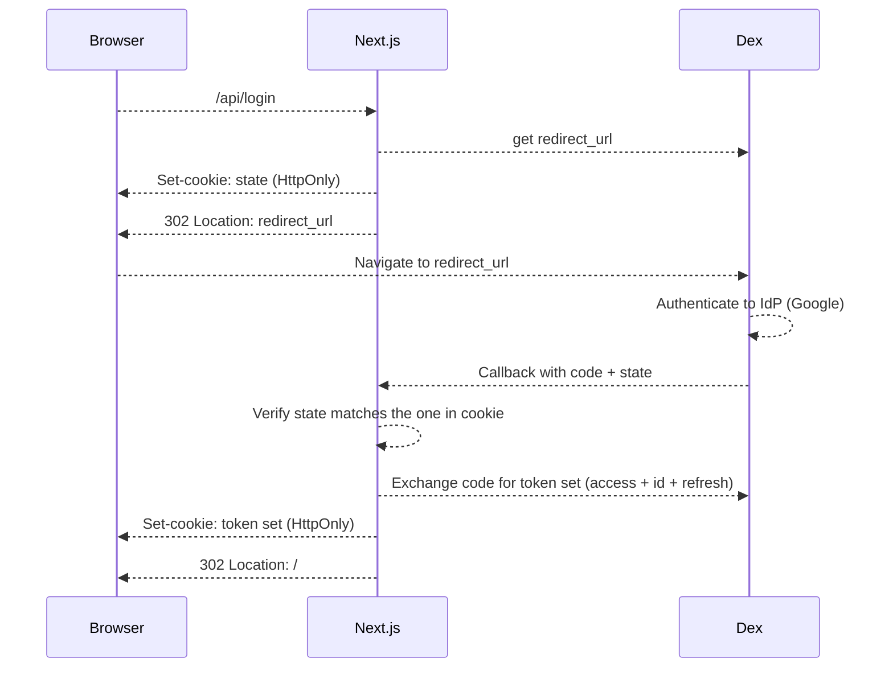

# Server side auth with DEX and vanilla Next.js

This implementation authenticates against a Dex instance with a vanilla implementation of the OIDC flow. The implementation is a porting of the `@auth0/nextjs-auth0`, stripped of all bells and whistles.

I don't think that maintaining a package for auth is a good idea, but it was a good learning exercise to grasp the complexity of implementing the flow correctly.

# How to run it

Edit the [example Dex config](./dex.config.yaml) with your google application client id and client secret:

```yaml
connectors:
  - type: google
    id: google
    name: Google
    config:
      issuer: https://accounts.google.com
      # Connector config values starting with a "$" will read from the environment.
      clientID: <your_client_id>
      clientSecret: <your_client_secret>
      redirectURI: "http://127.0.0.1:4433/dex/callback"
      hostedDomains:
        - casavo.com
```

After this, you can run dex (refer to [Dex docs]()):

```bash
./bin/dex serve ./dex.config.yaml
```

Run the app:

```bash
pnpm --filter next-app-vanilla dev
```

# How is the auth flow implemented?

For the source code, refer to the `nextjs-oidc` package in this same repository.



# What is missing for production

- Robustness
- A proper security assessment
- Seriously, do not put this in production ever
